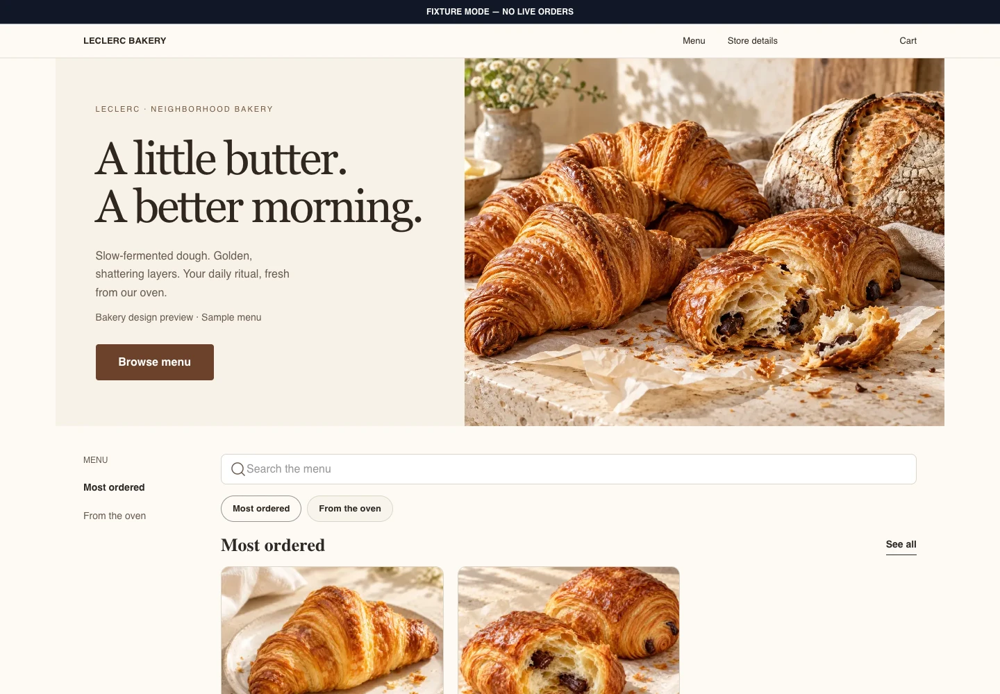
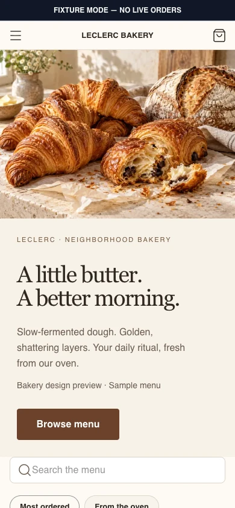

# Crave.js Web Storefront

A responsive Next.js storefront for restaurant ordering. Make the menu, photography,
and guest experience your own, with a shared commerce core for carts, fulfillment,
and hosted checkout.

**[Explore the storefront](https://developer.craveup.com/templates#cravejs-web-template)**
· [Run it locally](#run-the-bakery-preview)
· [Documentation](https://docs.craveup.com)
· [Storefront API contract](docs/contracts/STOREFRONT-API.md)

Next.js 16 · React 19 · Tailwind CSS v4 · TypeScript · MIT

## See the storefront

Meet **Leclerc Bakery**, the included Bakery Editorial visual preview. These are
captures of the running template at desktop and mobile web sizes.

<table>
  <tr>
    <th>Desktop</th>
    <th>Mobile web</th>
  </tr>
  <tr>
    <td valign="top"><a href="docs/images/storefront-desktop.webp"></a></td>
    <td valign="top"><a href="docs/images/storefront-mobile.webp"></a></td>
  </tr>
</table>

Try the **Desktop / Mobile** toggle in the [live showcase](https://developer.craveup.com/templates#cravejs-web-template),
or select either screenshot to view it at full size.

Leclerc Bakery and its menu are fictional; the food photography is AI-generated.
This preset demonstrates the responsive design. The separate ordering fixtures let
you explore menus, modifiers, carts, pickup, delivery, and checkout handoff without
credentials or live orders.

> **Preview availability:** the pictured bakery is published on
> [`feature/bakery-photo-preview`](https://github.com/craveup-oss/cravejs-web-template/tree/feature/bakery-photo-preview).
> Its merge into `main` is pending the required review in
> [PR #1](https://github.com/craveup-oss/cravejs-web-template/pull/1).
> The quickstart below selects that branch so you get the design shown here.

## Run the bakery preview

Use **Node.js 24** and **pnpm 10.33.2**. No Crave credentials are needed.

```bash
git clone --branch feature/bakery-photo-preview https://github.com/craveup-oss/cravejs-web-template.git
cd cravejs-web-template
corepack enable
pnpm install --frozen-lockfile
pnpm dev:fixtures --profile standalone-cli --tenant fixture-base
```

Open **[the bakery preview](http://localhost:3000/design-system-preview?preset=bakery-editorial&controls=0)**
to see the pictured storefront. Resize your browser to explore its mobile layout.

Open **[the ordering fixtures](http://localhost:3000)** to try the separate sample
ordering flow. Fixture mode is labeled **NO LIVE ORDERS**, makes no live API
requests, and disables Google Maps lookups even if a local environment contains a
browser key.

To adapt the bakery, start with its [sample content](src/presets/bakery-preview-data.ts),
[preset configuration](src/presets/storefront-presets.ts), and
[photography](public/assets/template/BAKERY-PHOTOGRAPHY.md).

> **Release status:** this is a public template preview with two runtime profiles.
> The public `crave` CLI generator and generated-project upgrade path have not
> shipped. Clone the source to run and adapt it; live ordering requires restaurant
> configuration and API access.

## Why teams start here

| You should get to design | You should not have to rebuild |
|---|---|
| Your restaurant's voice, photography, content, layout and theme | Menu and product contracts, nested modifier rules and server-calculated money |
| The moments that make the brand memorable | Cart authority, conflict recovery, session isolation and checkout handoff safety |
| The right experience for each location and service model | Pickup and delivery flows, plus preview-only tableside and room-service states |
| The extensions that make the storefront yours | Accessibility, localization, SEO, consent and credential boundaries |

The result is room for a distinctive restaurant experience without forking the commerce logic every
time the visual direction changes.

## Choose a visual direction

The template ships six generated theme systems—`base`, `ember`, `hearth`, `meadow`, `noir` and
`signal`—over one shared set of storefront routes and commerce behavior. Themes are selected from
validated merchant configuration, rendered on the server and tested without an unthemed first paint.

Use a theme as the starting point, then change documented theme inputs, public fonts, photography,
merchant content and exported composition slots. A visual concept does not need its own copy of the
SDK integration, cart or checkout code.

### Bakery preview and imagery

The Bakery Editorial preset includes AI-generated bakery photography and fictional
Leclerc Bakery sample content. Run the fixture server, then open
`/design-system-preview?preset=bakery-editorial&controls=0` to explore the responsive
visual preview. Ordering tests continue to use the canonical fixture menu. Other
presets ship repository-authored SVG placeholders. Every shipped asset is recorded with its SHA-256 digest in
[`distribution/asset-ownership.json`](distribution/asset-ownership.json), and the release gate rejects
any image whose rights are not confirmed. Replace the placeholders with your own photography.

## What is included

- **Browse and decide:** restaurant/location bootstrap, timed menus, categories, local search,
  product detail, availability, nutrition and nested modifiers.
- **Build and recover a cart:** server-authoritative totals, quantity changes, item notes,
  recommendations, discounts, tips and explicit retry after conflicts or stale state.
- **Choose how to order:** pickup now/later and delivery are wired. Tableside and room-service UI is
  a fixture-backed preview; completed-order detail persistence remains externally gated.
- **Complete the handoff:** checkout preflight and exact-origin navigation to Crave-hosted checkout;
  no Stripe or provider secrets in the storefront.
- **Come back recognized:** OTP account entry, account details, addresses, order history and
  capability-gated loyalty. Terminal order/receipt handling remains externally gated.
- **Ship with confidence:** responsive and 200% zoom coverage, keyboard/accessibility checks,
  localization and timezone rules, SEO, consent-aware telemetry and tested failure states.

## Pick a deployment profile

| Profile | Best for | Configuration authority |
|---|---|---|
| `hosted-multitenant` | Crave-managed storefronts and custom domains | A trusted server-only exact-host registry |
| `standalone-cli` | A restaurant or agency-owned Next.js project | One validated generated storefront config |

Both profiles use the same SDK adapters, commerce behavior, components, themes and fixtures. Only
bootstrap and distribution differ.

Copy [`.env.example`](.env.example) to `.env.local`, choose exactly one profile and replace every
example public value. The browser API origin must exactly match the selected `apiBaseUrl`. Never add
`CRAVE_API_KEY`, `NEXT_PUBLIC_CRAVEUP_API_KEY`, customer sessions, cart/receipt capabilities or
payment-provider values.

### Hosted multitenant

The runtime resolves a trusted host or custom domain to validated tenant configuration. Unknown hosts
fail closed before API reads. Tenant identity participates in cache, theme, metadata, canonical URL,
robots/sitemap, structured data and asset decisions so one merchant cannot leak into another.

### Standalone CLI

The approved contract requires the separate `crave` CLI to consume an immutable release of this
repository and emit validated public configuration plus exact `.crave/storefront-template.json`
provenance. That generator has not shipped yet. When it does, it will not import the hosted registry,
generate from a mutable branch, or read a private repository or API key. Upgrades dry-run and diff,
and never silently overwrite user-owned extensions.

See [`docs/contracts/GENERATED-STARTER.md`](docs/contracts/GENERATED-STARTER.md) for the exact
generated-project contract.

## Concept presets

One storefront product and one commerce core. Four visual presets preserve useful design ideas from
earlier public storefront experiments without carrying forward their SDK 1.x, API-key, Stripe, cart
or checkout implementations.

| Preset | Default theme | Home composition |
|---|---|---|
| `bakery-editorial` | Hearth | Editorial product story |
| `noodle-house` | Ember | Immersive food hero |
| `sushi-atelier` | Noir | Split editorial grid |
| `counter-service` | Signal | Service-first ordering |

Start either fixture profile, then open `/design-system-preview?preset=bakery-editorial` and switch
presets from the preview toolbar.

## Shared architecture

- **Direct public API:** no Crave BFF and no browser API key.
- **Two SDK clients:** Server Components perform anonymous reads; client islands perform stateful
  calls through the exact SDK 2.x browser client.
- **Typed bootstrap:** hosted trusted registry and standalone generated config implement one
  `TenantResolver`/resolved-config boundary.
- **Capability lifecycle:** cart revisions/capabilities and customer/receipt sessions stay tab-scoped
  in versioned adapters.
- **Capability-gated loyalty:** a disabled or unavailable provider never blocks ordering or checkout.
- **Conflict-safe mutations:** conflicts refresh authoritative state and require explicit customer
  retry; safe lost-response transport retries reuse the identical body and key.
- **Server-calculated money:** the UI renders returned display fields and never calculates totals.
- **Server-rendered theming:** six generated theme blocks with no unthemed first paint. `?theme=` is
  labeled preview-only and ignored in production.
- **Recovery as a contract:** refresh/back, duplicate tabs, expiry, offline, price/inventory/time
  drift, OTP limits and hosted-handoff states are finite tested behavior.

Read the [Storefront API contract](docs/contracts/STOREFRONT-API.md) and the
[generated-starter contract](docs/contracts/GENERATED-STARTER.md) before writing application code.
The pinned OpenAPI document is [`docs/contracts/storefront-api.openapi.json`](docs/contracts/storefront-api.openapi.json).

## Verification

| Command | Purpose |
|---|---|
| `pnpm verify` | lint and typecheck gate for this repository |
| `pnpm lint` | ESLint across the template |
| `pnpm typecheck` | Next.js typegen plus `tsc --noEmit` |
| `pnpm build` | production build |
| `pnpm profile:smoke` | production server smoke for the selected profile after `pnpm build` |
| `pnpm distribution:payload` | build the deterministic CLI payload archive |
| `pnpm release:assemble -- --release <semver> --released-at <UTC> --output <absolute-path>` | assemble a deterministic release artifact and manifest from a clean exact commit |

This repository carries the application and its release tooling. The template's own design pipeline
and internal gate suites are not part of the public snapshot, so the commands above are the complete
set it can run.

## Provenance

This repository is generated. Each commit is a validated snapshot of a reviewed private engineering
commit, and [`.crave/source.json`](.crave/source.json) records the exact source repository and
commit. Release tags are created only from a commit on `main` after an approval-gated workflow
reverifies the tree, so a published release names the precise bytes it was built from.

Send code and documentation changes here as pull requests; maintainers apply accepted changes to the
engineering source, and the next sync brings them back into this repository.

## Community, support and sponsorship

- Read [CONTRIBUTING.md](CONTRIBUTING.md) before proposing code or documentation changes.
- Report vulnerabilities privately using [SECURITY.md](SECURITY.md), never through a public issue.
- Use [SUPPORT.md](SUPPORT.md) to distinguish reproducible project bugs from Crave implementation
  services and legacy-storefront questions.
- Read [GOVERNANCE.md](GOVERNANCE.md) for maintainer, release and sponsor decision boundaries.
- Participation is governed by [CODE_OF_CONDUCT.md](CODE_OF_CONDUCT.md).

## License

[MIT](LICENSE) © Crave Up, Inc.
